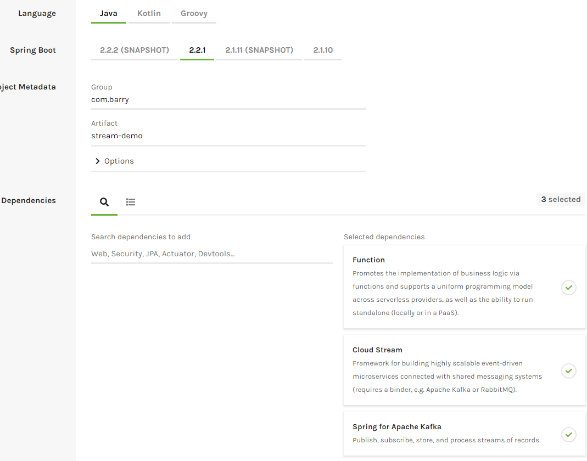

# SpringBoot-Kafka-Tutorial
Simple Tutorial using Spring Boot (Cloud and Function) with Kafka

# Prerequsites:
1. Admin Rights on your machine to install and configure software.
1. Java development Kit (JDK 8) - [Download here](http://www.oracle.com/technetwork/java/javase/downloads/jdk8-downloads-2133151.html)
1. Maven 3.x - [Download Maven here](https://maven.apache.org/download.cgi)
   - How to install Maven [Install guide](https://www.mkyong.com/maven/how-to-install-maven-in-windows/)
1. An IDE or Text Editor (Use your favorite). Some options if you don't have one: [SpringSource Tool Suite - Eclipse based](https://spring.io/tools/sts/all) or [Visual Studio Code](https://code.visualstudio.com/)
1. Access to Kafka.
   - Either install [Kafka](https://kafka.apache.org/downloads) locally for the least amount of application configuration(but more setup)
      - [Quick Start for installing Kafka](https://kafka.apache.org/quickstart)

   - Have access to a Kafka installation (requires configuring the app to point to external kafka and access to create topics)
   
### Nice to know commands:
```
Start Zookeeper
bin/zookeeper-server-start.sh config/zookeeper.properties

start Kafka
bin/kafka-server-start.sh config/server.properties


Create a topic
bin/kafka-topics.sh --create --zookeeper localhost:2181 --replication-factor 1 --partitions 1 --topic test

List topics
bin/kafka-topics.sh --list --zookeeper localhost:2181

start console/command line producer to write to test topic
bin/kafka-console-producer.sh --broker-list localhost:9092 --topic input

start console/commandline consumer to read messages from test topic
bin/kafka-console-consumer.sh --bootstrap-server localhost:9092 --topic output --from-beginning

```


Start at [start.spring.io](https://start.spring.io/)


